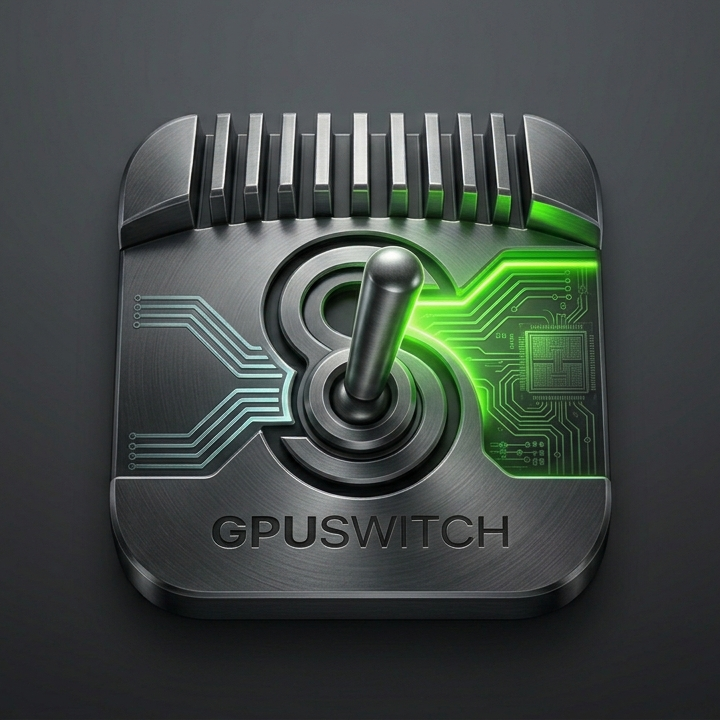

<div align="center">



&nbsp;

&nbsp;


**Switch between integrated, discrete, and auto GPU on Intel Macs via pmset**

<a href="https://kud.io/projects/gpuswitch-cli">Website</a> · <a href="https://kud.io/projects/gpuswitch-cli/docs">Documentation</a>

</div>

---

A thin, scriptable wrapper around macOS `pmset` for switching your Intel Mac's GPU — with an interactive TUI.

## Install

```bash
npm install -g @kud/gpuswitch-cli
```

## Development

```bash
git clone https://github.com/kud/gpuswitch-cli.git
cd gpuswitch-cli
npm install
npm run build
node dist/index.js
```

---

📚 **Full documentation → https://kud.io/projects/gpuswitch-cli/docs**
